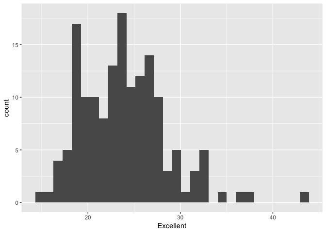
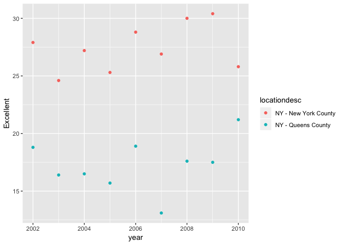

p8105\_hw2\_tm2680
================
Tatini Mal-Sarkar
9/25/2018

Problem 1
=========

``` r
transit_data = read_csv(file = "./data/NYC_Transit_Subway_Entrance_And_Exit_Data.csv") %>% 
  janitor::clean_names() %>% 
  select(line, station_name, station_latitude, station_longitude, starts_with("route"), entry, vending, entrance_type, ada) %>% 
  mutate(entry = ifelse(entry == "YES", TRUE, FALSE))
```

    ## Parsed with column specification:
    ## cols(
    ##   .default = col_character(),
    ##   `Station Latitude` = col_double(),
    ##   `Station Longitude` = col_double(),
    ##   Route8 = col_integer(),
    ##   Route9 = col_integer(),
    ##   Route10 = col_integer(),
    ##   Route11 = col_integer(),
    ##   ADA = col_logical(),
    ##   `Free Crossover` = col_logical(),
    ##   `Entrance Latitude` = col_double(),
    ##   `Entrance Longitude` = col_double()
    ## )

    ## See spec(...) for full column specifications.

This dataset `transit_data` contains variables pertaining to the subway, station name, station latitude and longitude, routes, entry, vending, entrance type, and ADA compliance. So far, I have cleaned the variable names, chosen the aforementioned variables, and transformed the character variable `entry` to a logical variable. The dataset `transit_data` contains 1868 rows and 19 columns. Before gathering, this dataset is not tidy.

There are 465 distinct stations. There are 84 ADA-compliant stations. 0.3770492 of station entrances without vending allow entrance.

``` r
transit_data =
  gather(transit_data, route1:route11, key = "route_number", value = "route_name") 
```

60 distinct stations serve the A train. Of these stations, 17 are ADA-compliant.

Problem 2
=========

``` r
trash_data_mr = read_excel("data/HealthyHarborWaterWheelTotals2017-9-26.xlsx", sheet = "Mr. Trash Wheel", range = cell_cols("A:N")) %>% 
  janitor::clean_names() %>% 
  drop_na(dumpster) %>% 
  mutate(sports_balls = as.integer(round(sports_balls, 0)))
```

``` r
trash_data_2017 = read_excel("data/HealthyHarborWaterWheelTotals2018-7-28.xlsx", sheet = "2017 Precipitation", skip = 1) %>% 
  janitor::clean_names() %>% 
  drop_na(total) %>% 
  drop_na(month) %>% 
  mutate(year = 2017)
```

``` r
trash_data_2016 = read_excel("data/HealthyHarborWaterWheelTotals2017-9-26.xlsx", sheet = "2016 Precipitation", skip = 1) %>% 
  janitor::clean_names() %>% 
  drop_na(total) %>% 
  drop_na(month) %>% 
  mutate(year = 2016)
```

``` r
trash_data_16_17 = full_join(trash_data_2016, trash_data_2017) %>% 
  mutate(month = month.name[month])
```

    ## Joining, by = c("month", "total", "year")

Datasets `trash_data_mr` and `trash_data_16_17` describe data collected from the Healthy Harbor initiative. `trash_data_mr` contains 216 observations. Key variables include date, weight, and volume. `trash_data_16_17`contains 20 observations, with far fewer variables. These variables include month, year, and total precipitation. The total precipitation in 2017 was 32.93. The total precipitation in 2016 was 39.95. The median number of sports balls in a dumpster in 2016 was NA.

Problem 3
=========

``` r
library(p8105.datasets)
brfss_data = brfss_smart2010 %>% 
  janitor::clean_names() %>% 
  filter(topic == "Overall Health") %>% 
  select(-class, -topic, -question, -sample_size, -confidence_limit_low:-geo_location) %>% 
  spread(response, data_value) %>% 
  janitor::clean_names() %>% 
  mutate(prop_exc_vgood = (excellent + very_good) / 100)
```

There are 404 unique locations in the dataset `brfss_data`. Because 51 states/provinces are represented, every state and Washington, D.C. are represented.

NJ is the state most observed.

The median of the Excellent response value is 23.6.

``` r
brfss_data %>% 
  filter(year == 2002) %>% 
  ggplot(aes(x = excellent)) +
  geom_histogram()
```

    ## `stat_bin()` using `bins = 30`. Pick better value with `binwidth`.

    ## Warning: Removed 2 rows containing non-finite values (stat_bin).



``` r
brfss_data %>% 
  filter(locationdesc == "NY - New York County" | locationdesc == "NY - Queens County") %>% 
  ggplot(aes(x = year, y = excellent)) +
  geom_point(aes(color = locationdesc))
```


